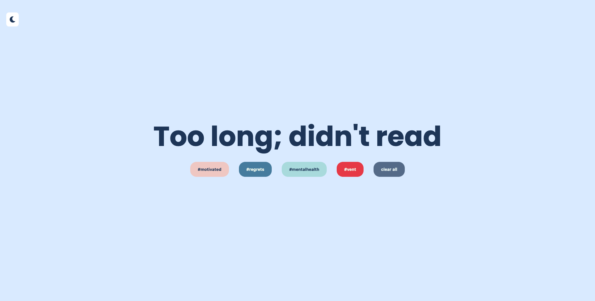

## TL;DR Group Project

Welcome to our anonymous message posting blog. Have fun choosing a category to voice your opinions about but make sure you message is below 100 characters. Other features include, sending gifs, replying to messages, reacting using emojis and filter the category you are interested in.

## Installation

1. Clone the repo
   `sh git clone https://github.com/Wheres-Roneey/Heres-Roneey.git `
2. Install NPM packages
   `sh npm install`

## Usage

- Open our website using the link (https://tldr-blog.netlify.app/)
  
- Light mode feature
  
- Card Layout
  
- New Card
  

## Technologies

- Javascript
- HTML
- CSS

## Process

- Used a Source of Truth template to discuss app features and target audience.
  - Decided on a confession page for young adults with 100 character max limit.
- Designed website layout using Figma and chose to use vanilla CSS for the design.
- Created server to get and post messages, and client side to fetch messages and post them on the website.
- Added functions one by one.
  - Add new confession (new card).
  - Reply function.
  - Light/Dark mode.
  - Clickable tags to filter cards (message posts).
  - Emoji React counter.
  - Profanity filter.
  - Add gif to messages.
- Added CSS styling.

  - Title page.
  - Tag bar.
  - Card design.
  - Light mode button.
  - Website postioning.

  -Deployed website, Netlify for Cilent and Heroku for Server.
  -Implemented tests.

## Licences

- No licences being used.

## Wins and Challenges

### Wins

- Adding new cards with all the features on.
- Having fun with giphy.
- Styling grid collapsing using CSS variables.

### Challenges

- Getting to 60-80% test coverage.
- Getting Heroku to work.
- Merging deleting code causing errors.
